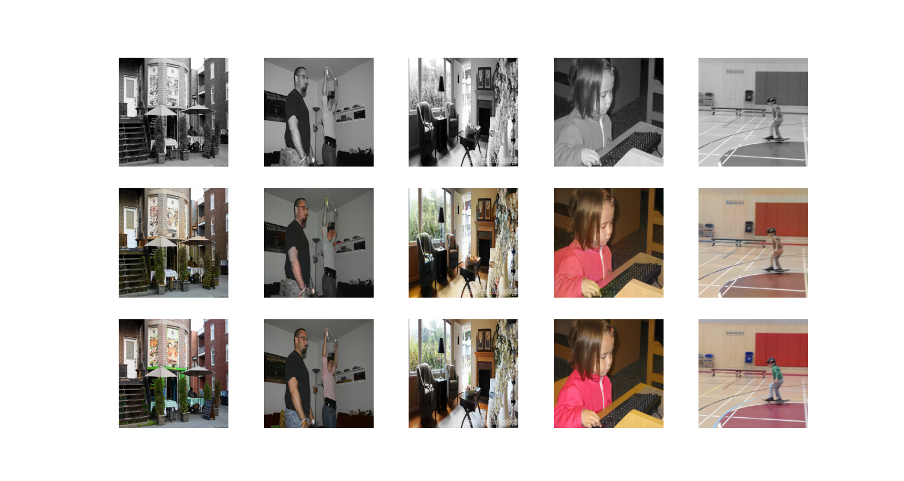

### Image colorization

Adapted from [https://github.com/moein-shariatnia/Deep-Learning/tree/main/Image%20Colorization%20Tutorial](https://github.com/moein-shariatnia/Deep-Learning/tree/main/Image%20Colorization%20Tutorial).

#### Baseline:

Sampled 10000 COCO images for training

Sample output after training:

