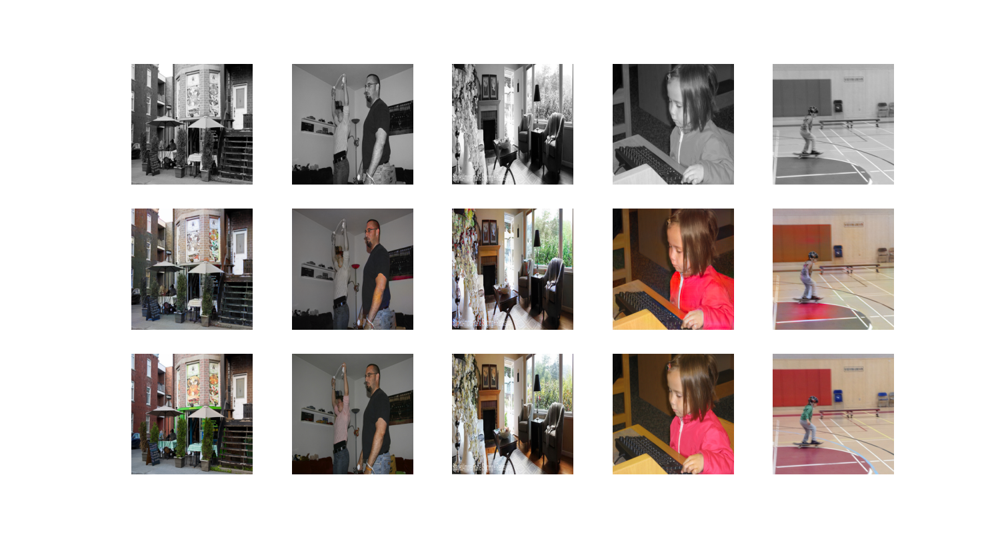

### Image colorization

#### Baseline:

Sampled 10000 COCO images for training

Sample output after 100 epochs of adversarial training with baseline generator:

#### Pretrained generator

Sample output after 20 epochs of adversarial training with pretrained generator:

Adapted from [https://github.com/moein-shariatnia/Deep-Learning/tree/main/Image%20Colorization%20Tutorial](https://github.com/moein-shariatnia/Deep-Learning/tree/main/Image%20Colorization%20Tutorial).